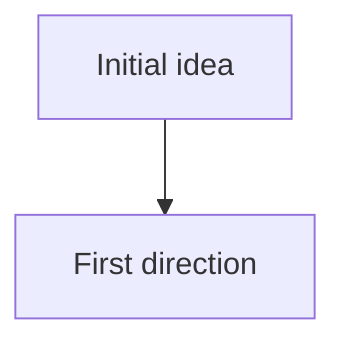

# Ideas trail — <your-project-name>

Chronological, agent-maintained narrative of how this project's thinking has evolved. Pivots, corrections, abandoned directions, open risks.

**This file is agent-maintained.** Update it proactively without waiting to be asked. Append only — never rewrite prior entries.

## When to append

- **Pivot** — direction changes, scope expands or narrows, an assumption is dropped.
- **Correction** — the user corrects your framing, or you correct an earlier oversimplification.
- **New candidate direction** — an idea arises that was not in the original plan.
- **Risk or open problem** — a blocker or unknown is surfaced.
- **Load-bearing clarification** — a concept is clarified well enough that future work depends on it.

Do **not** log routine Q&A, tutorial explanations, or tool-use steps. Filter: *would a future session be meaningfully worse off without this entry?*

## Format

```
### <Pivot N | Correction | Candidate direction | Risk> — short title

2–6 sentences of substance. Record both the idea and any caveat or pushback.
Honest framing over flattering framing.
```

## Flowchart

<!-- Optional. Update when a new entry represents a branch or pivot worth visualizing.


-->

---

<!-- Entries below, newest at the bottom. -->
